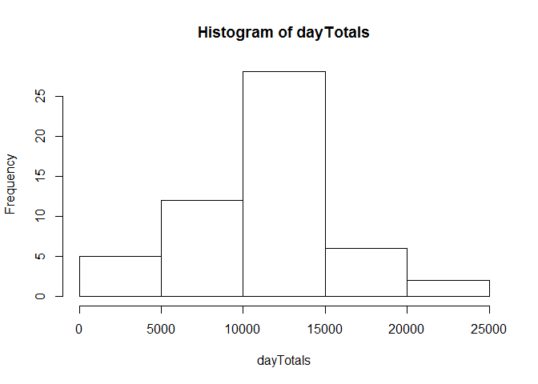
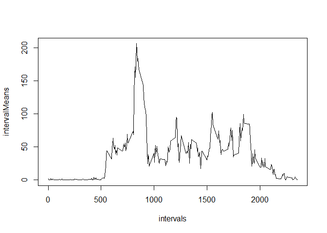
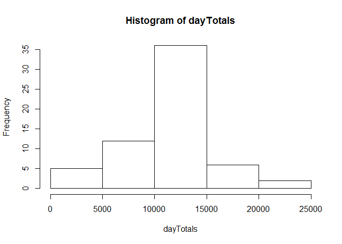
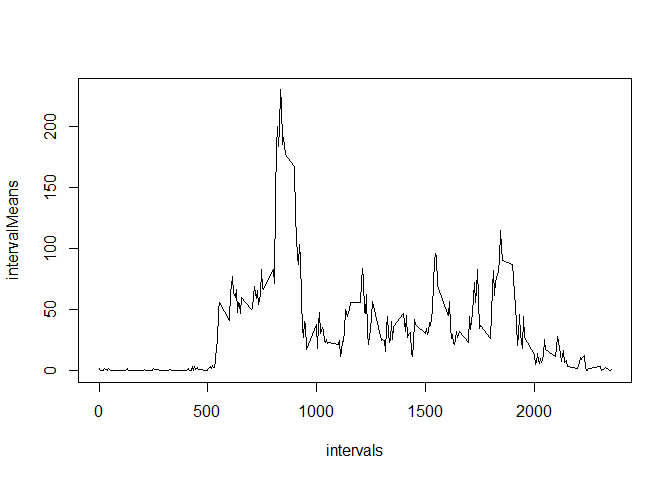
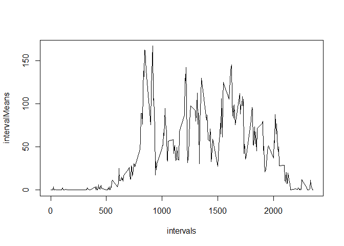

# steps.Rmd

Exercise for Coursera "Reproducible Research"

Read in the source data:

```r
activity<-read.csv("activity/activity.csv")
source("steps.R")
```

##What is mean total number of steps taken per day?

Histogram of total steps per day


```r
activityHistByDay(activity)
```

 

Mean and Median of average steps per day


```r
activityMeanAndMedian(activity)
```

```
## [1] 10766.19 10765.00
```

##What is the average daily activity pattern?

Plot of average steps per interval


```r
activityPlotByInterval(activity)
```

 

Which interval has greatest average?


```r
activityWhichMax(activity)
```

```
## [1] 835
```

##Inputing missing values

How many incomplete rows?


```r
sum(!complete.cases(activity))
```

```
## [1] 2304
```

Fill incomplete rows using averages for intervals


```r
activitymod <- activityFillNAs(activity)
```


Histogram of total steps per day - incomplete rows filled


```r
activityHistByDay(activitymod)
```

 

Mean and Median of total steps per day - incomplete rows filled


```r
activityMeanAndMedian(activitymod)
```

```
## [1] 10766.19 10766.19
```

##Are there differences in activity patterns between weekdays and weekends?

Set Weekend / weekday as "dayType""


```r
activitymod<-setDayTypes(activitymod)
```

Plot of average steps per interval for Weekdays - incomplete rows filled


```r
activityPlotByInterval(activitymod[activitymod[4]=="weekday",])
```

 


Plot of average steps per interval for Weekends - incomplete rows filled


```r
activityPlotByInterval(activitymod[activitymod[4]=="weekend",])
```

 

